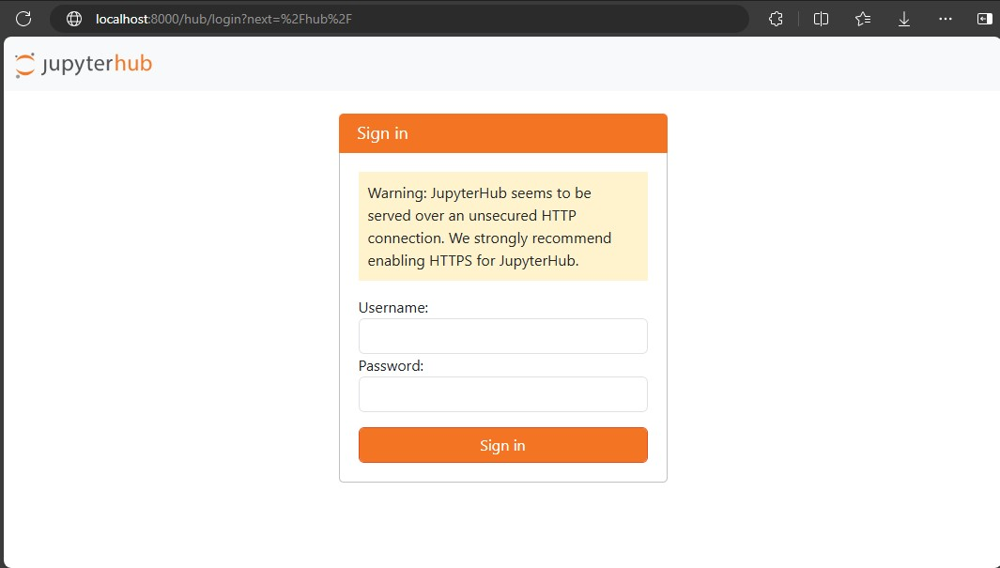

# `Dockerfile`'ы

## Плохой Dockerfile

```dockerfile
FROM jupyterhub/jupyterhub:latest

RUN apt-get update && apt-get install -y \
    curl \
    vim \
    git \
    nodejs \
    npm

WORKDIR /jupyterhub

ENTRYPOINT jupyterhub --port 8000
```

## Хороший Dockerfile

```dockerfile
FROM jupyterhub/jupyterhub:5.0.0  

RUN apt-get update && apt-get install -y \
    git  

WORKDIR /jupyterhub

ENTRYPOINT jupyterhub
```

## Что исправлено?

1. Добавлена конкретная версия базового образа. Теперь используется образ `jupyterhub/jupyterhub:5.0.0`.

    Использование конкретной версии базового образа помогает избежать неожиданных изменений при обновлении образа.

2. Удаление хардкода порта для запуска приложения. 

    Указание порта внутри `Dockerfile` ограничивает гибкость запуска приложения внутри контейнера. Лучше задавать порт при запуске контейнера.

3. Убрана установка ненужных зависимостей.

    Установка только необходимых зависимостей уменьшает размер образа, улучшает безопасность образа и снижает вероятность возникновения проблем с совместимостью.

# Проверка работы

## Сборка контейнера

```bash
docker build -t my-jupyter . 
```

## Запуск контейнера

```bash
docker run -d -p 8000:8000 -v /path/to/data:/jupyterhub --name my-j my-jupyter:latest --port 8000
```

## Проверка



# Практики использования контейнеров

## Плохие практики использования созданного контейнера

1. Хранения состояния внутри контейнера.

    При создании новой версии образа и запуска контейнера на основе этого образа все данные будут утеряны.

2. Отсутствие указания конкретного образа для запуска.

    Если не указать образ при запуске могут возникнуть проблемы, например, стандартый порт может быть уже занят.

## Плохие практики использования контейнеризации в целом

1. Когда приложение является десктопным клиентом. Использование библиотек для предоставления графического интерфейса является нежелательным. Контейнеры изначально задумывались для запуска приложений на серверах.

2. Развертка баз данных в продакшн средах. Docker может потерять важные файлы и данные.