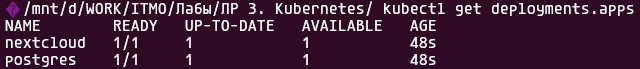
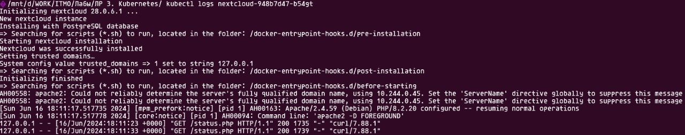

# Ход работы

## 1. Создание Secret для PostgreSQL

Отдельный файл с манифестом выглядит следующим образом:
```yaml
apiVersion: v1
kind: Secret
metadata:
  name: pg-auth-data
  labels:
    app: postgres
type: Opaque
stringData:
  POSTGRES_USER: "postgres"
  POSTGRES_PASSWORD: "password"
```

Для использования данного объекта необходимо изменить манифест Deployment:

```yaml
spec:
  template:
    spec:
      containers:   
        - name: postgres-container
          envFrom:
            - configMapRef:
                name: postgres-configmap
            - secretRef:
                name: pg-auth-data
```

## 2. Выделение манифеста Secret для NextCloud в отдельный файл

Для улучшения читаемости выделяем манифест в отдельный файл.


## 3. Создание ConfigMap для NextCloud

Манифест представлен ниже:

```yaml
apiVersion: v1
kind: ConfigMap
metadata:
  name: nextcloud-configmap
  labels:
    app: nextcloud
data:
  NEXTCLOUD_UPDATE: "1"
  ALLOW_EMPTY_PASSWORD: "yes"
  POSTGRES_HOST: "postgres-service"
  NEXTCLOUD_TRUSTED_DOMAINS: "127.0.0.1"
  NEXTCLOUD_ADMIN_USER: "admin"
```

Для использования данных, которые теперь в манифесте Secret для PostgreSQL и в манифесте ConfigMap для Nextcloud 
конфигурацию Deployment для NextCloud нужно изменить:

```yaml
spec:
  template:
    spec:
      containers:
        - name: nextcloud
          envFrom:
            - configMapRef:
                name: nextcloud-configmap
            - secretRef:
                name: pg-auth-data
            - secretRef:
                name: nextcloud-secret
```

## 4. Добавление livenessProbe и readinessProbe

livenessProbe и readinessProbe будут выполнять запрос на localhost/status.php с помощью curl
с начальной задержкой в 10 секунд каждая.
```yaml
spec:
  template:
    spec:
      containers:
        - name: nextcloud
          livenessProbe:
            exec:
              command:
                - curl
                - -f
                - http://localhost/status.php
            initialDelaySeconds: 10
          readinessProbe:
            exec:
              command:
                - curl
                - -f
                - http://localhost/status.php
            initialDelaySeconds: 10
```

## Результаты работы



# Ответы на вопросы

## Важен ли порядок выполнения этих манифестов? Почему?

Порядок манифестов важен в случаях, когда один ресурс зависит от другого. 
Утилита kubectl при передачи нескольких файлов учитывает порядок и создает сначала ресурсы, 
которые необходимы другим ресурсам.