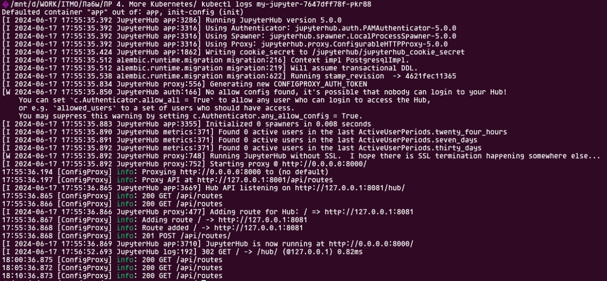

Все манифесты были созданы и представлены в этой директории.

Локальный образ был добавлен в minikube с помощью следующего набора команд:

```bash
eval $(minikube -p minikube docker-env) # Использовать Docker daemon из Minikube
docker build -t my-jupyter:latest .
```

# Скриншоты


